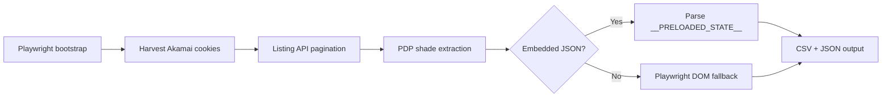

# Nykaa Lip Liner Scraper

A production-ready Python scraper that collects all lip liner products from [Nykaa](https://www.nykaa.com) along with every shade variant. Output is flattened to **one row per shade** in CSV and JSON.

Built to handle Nykaa's Akamai bot protection using a hybrid **Playwright + httpx** approach — fast API pagination for discovery, embedded JSON for shade data, and browser fallback when needed.

---

## Highlights

- **~156 products** and **~700 shade rows** across **78+ brands** (full category scrape)
- Async pipeline with configurable concurrency and jittered rate limiting
- Automatic retries via `tenacity` on transient failures
- Structured logging, failed-URL tracking, and raw API snapshots for debugging
- Pre-commit hook to prevent accidentally committing `.venv`, outputs, or logs

---

## How it works

Nykaa exposes JSON listing and product APIs, but plain HTTP clients get blocked (HTTP 403). This scraper bootstraps a real browser session first, then reuses cookies for fast API calls.



| Step | Method | Endpoint / source |
|------|--------|-------------------|
| Session bootstrap | Playwright | `GET /makeup/lips/lip-liner/c/251` |
| Product discovery | httpx + cookies | `GET /app-api/index.php/products/list?category_id=251` |
| Shade extraction | httpx / Playwright | PDP `window.__PRELOADED_STATE__` |

---

## Quick start

```bash
git clone https://github.com/JBahulika/LipScrapperNykaa.git
cd LipScrapperNykaa

python -m venv .venv
source .venv/bin/activate        # Windows: .venv\Scripts\activate
pip install -r requirements.txt
playwright install chromium

# Test run (5 products)
python scraper.py --limit 5

# Full scrape
python scraper.py
```

Outputs are written to:

- `output/lipliners.csv`
- `output/lipliners.json`

---

## Requirements

| Dependency | Purpose |
|------------|---------|
| Python 3.10+ | Runtime |
| Playwright + Chromium | Akamai session bootstrap & PDP fallback |
| httpx | Async HTTP client for APIs |
| pandas | CSV export |
| tenacity | Retry logic |

---

## Usage

```bash
# Full category scrape
python scraper.py

# Dev / test run
python scraper.py --limit 5
```

### Environment variables

| Variable | Default | Description |
|----------|---------|-------------|
| `SCRAPER_ENV` | `dev` | `dev`, `test`, or `prod` |
| `HEADLESS` | `false` (dev), `true` (prod) | Run browser headless |
| `MAX_CONCURRENT_REQUESTS` | `5` | Concurrent PDP fetches |
| `MIN_DELAY_SECONDS` | `0.5` | Minimum delay between requests |
| `MAX_DELAY_SECONDS` | `1.5` | Maximum delay between requests |
| `MAX_RETRIES` | `4` | Retry attempts on failure |
| `AKAMAI_WAIT_SECONDS` | `5` | Wait after browser bootstrap |
| `REQUEST_TIMEOUT` | `30` | HTTP timeout (seconds) |
| `PROXY` | unset | Optional proxy URL |

Example:

```bash
SCRAPER_ENV=prod HEADLESS=true python scraper.py
```

---

## Output schema

Each shade variant becomes one row with 17 fields:

| Column | Description |
|--------|-------------|
| `brand` | Brand name |
| `product_name` | Parent product name |
| `product_url` | Parent product URL |
| `product_id` | Parent product ID |
| `category` | Category (`Lip Liner`) |
| `price` | Selling price (INR) |
| `mrp` | Maximum retail price |
| `discount_percent` | Discount % |
| `rating` | Average rating (1–5) |
| `review_count` | Review count |
| `stock_status` | Parent stock status |
| `shade_name` | Shade / variant name |
| `shade_id` | Shade product ID |
| `shade_url` | Shade PDP URL |
| `shade_image` | Shade swatch image URL |
| `shade_availability` | Shade stock status |
| `shade_sku` | Shade SKU |

**Sample row:**

```csv
brand,product_name,product_url,product_id,category,price,mrp,discount_percent,rating,review_count,stock_status,shade_name,shade_id,shade_url,shade_image,shade_availability,shade_sku
Maybelline New York,Maybelline New York Lifter Liner Lip Liner Pencil With Hyaluronic Acid,https://www.nykaa.com/maybelline-new-york-lifter-liner-lip-liner-pencil-with-hyaluronic-acid/p/22380615,22380615,Lip Liner,479.0,599.0,20.0,4.5,800,in_stock,Cross The Line,22380608,https://www.nykaa.com/...,https://images-static.nykaa.com/...,out_of_stock,MAYBE00001393
```

---

## Project structure

```
nykaa_lipliner_scraper/
├── scraper.py              # Main orchestrator
├── config.py               # Settings, endpoints, env vars
├── nykaa_session.py        # Playwright bootstrap + httpx client
├── listing.py              # Category listing API pagination
├── shades.py               # PDP shade extraction
├── models.py               # Data models and row flattening
├── io_utils.py             # Logging and output writers
├── requirements.txt
├── .gitignore
├── .githooks/
│   └── pre-commit          # Blocks committing generated files
├── output/                 # Generated (gitignored)
├── logs/                   # Run logs (gitignored)
└── data/
    └── raw_api_responses/  # Debug snapshots (gitignored)
```

---

## Git hooks

A pre-commit hook is included to stop `.venv`, scrape outputs, logs, and raw API dumps from being committed.

Enable it after cloning:

```bash
cp .githooks/pre-commit .git/hooks/pre-commit
chmod +x .git/hooks/pre-commit
```

---

## Troubleshooting

### HTTP 403 / Access Denied

Nykaa uses Akamai protection. If requests still fail after bootstrap:

- Run with `HEADLESS=false` to confirm the browser passes the challenge
- Set `PROXY` to a residential proxy if your IP is blocked
- Increase `AKAMAI_WAIT_SECONDS`

### Missing shades

Some PDPs don't expose full shade data in embedded JSON. The scraper falls back to browser rendering. Check `logs/failed_urls.txt` for products that need manual review.

### Slow runs

Shade extraction requires one request per configurable product. Use `--limit` for testing. Increase `MAX_CONCURRENT_REQUESTS` carefully to avoid rate limiting.

---

## Performance

| Stage | Typical cost |
|-------|--------------|
| Listing discovery | ~8 API calls (20 products/page) |
| Shade extraction | 1 request per product |
| Browser | Launched once, reused for fallbacks |
| Full run | ~3–8 minutes |

---

## Logs & debugging

| Path | Contents |
|------|----------|
| `logs/scraper.log` | Structured run log with counts and timing |
| `logs/failed_urls.txt` | Failed product URLs with timestamps |
| `data/raw_api_responses/` | Raw JSON snapshots (first listing page) |

---

## Disclaimer

This project is for **educational and research purposes only**. Respect [Nykaa's Terms of Service](https://www.nykaa.com/terms-conditions/nc) and use reasonable rate limits. Do not overload their servers. The authors are not affiliated with Nykaa.

---

## License

This repository is provided as-is with no warranty. Add a license file if you plan to open-source or redistribute.
